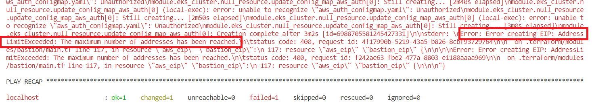
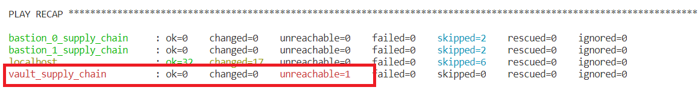

# Infrastructure Enablement AWS

## Scope

This repository is dedicated to handle the automation of the infrastructure of the Accenture Blockchain Fulcrum Project.

## Main Technologies

- Terraform >= 0.12.15
- Ansible >= 2.8.5
- AWS
- Kubernetes
- Vault

## Important notes

When deploying, each organization is equivalent to a VPC and all child resources. This configuration is being centralized in one `network.yml` file.

## Requirements

> Note that all the below tools are pre-installed in the included `Dockerfile.ci` - and can be used for local development or for CI/CD systems. For CI/CD systems, use a slave config as per the latest guidance in https://alm.accenture.com/wiki/pages/viewpage.action?pageId=271249907

1. Install [Terraform](https://www.terraform.io/) and make sure it's on your `PATH`. Version **0.12.x** must be used. (When testing, Terraform version is 0.12.15).
2. Install [OpenShift](https://github.com/openshift/origin/releases/download/v3.11.0/openshift-origin-client-tools-v3.11.0-0cbc58b-linux-64bit.tar.gz) Version **3.11.x** must be used. (When testing, OpenShift version was: 3.11.0).
3. Install the relevant tools for the cloud provider of choice:
   - AWS:
     - Install [AWS CLI](https://docs.aws.amazon.com/cli/latest/userguide/cli-chap-install.html). Version **1.16.x** must be used. (When testing, AWS CLI version was: 1.16.166).
     - Install [aws-iam-authenticator](https://docs.aws.amazon.com/eks/latest/userguide/install-aws-iam-authenticator.html).
4. If using ansible for IaaC make sure your host has Python 3.0+ installed.
5. You'll need to create a SSH key pair on the host for the user that is running the playbooks. This key will be used to connect to the bastion/vault instances with ansible. Also, the public key must be added to the AWS Codecommit by following [this](https://docs.aws.amazon.com/IAM/latest/UserGuide/id_credentials_ssh-keys.html).
6. A domain name should exist or be purchased. A custom list of nameservers should be allowed to be configured.
7. OPTIONAL - Ensure that a remote backend has been configured for Terraform. Official documentation can be found [here](https://www.terraform.io/docs/backends/types/remote.html). Although this is optional, it is highly recommended as it allows for state persistence, as well as multiple developers working on the same set of infrastructure.

## Configuration

1. If a remote backend has been set up, configure the backend with a map of the required values
   - AWS example:
     ```yaml
     bucket: "<bucket>"
     key: "<key>"
     region: "<region>"
     dynamodb_table: "<dynamo_table>"
     ```
2. The `organizations.meta.name` key on the _network.yml_ file must have **A UNIQUE** value **for each  or environment**.
3. Ensure cloud access keys are in environment variables
4. In the allowed_ingress_cidr_range block you can add the hosts' Public IP's that you want to connect from to the bastion. For Ansible to use the Bastion as Jumper, you must add the host's IP to the allowed_ingress_cidr_range **for each organization** on your \_network.yml* file. i.e.:
   ```yaml
   allowed_ingress_cidr_range:
      # Dev instance
      - "52.57.247.164/32"
      - "90.218.123.166/32"
     - ...
   ```
5. For the `domain` field inside `meta`, put the registered domain name. If this is not supplied, i.e. empty string (`""`), Terraform will not create NS records that allow delegation of DNS lookups to AWS. The user will then need to look at the Terraform outputs for the list of nameservers, and configure this in their domain provider under a NS record.
6. Add your **public key** content that correspond to the private key you used on the last step to the _network.yml_ file **for each organization** on the following lines:
   ```yaml
   vault_public_key: "ssh-rsa..."
   bastion_public_key: "ssh-rsa..."
   ```
7. Each organization should have its own IP segment. Values under 'cidr', 'public_subnets' and 'private_subnets' should be different on each organization.
8. Also the tags must be defined **for each organization**.

   ```yaml
   tags:
     foo: "bar"
   ```

   > NOTE - The credentials need the have the rights to read and write over the following Amazon Services/Resources:

   ```
   - VPC
     - VPC
     - Internet gateways
     - NAT gateways
     - Subnets
     - Network Interfaces
   - EKS
     - Clusters
   - EC2
     - Instances
     - Security Groups
     - Auto Scaling Groups
     - Elastic IPs
     - Key Pairs
   - KMS
     - Customer Managed Key
   - CloudWatch
     - Log Group
   - IAM
     - Groups
     - Users
     - Roles
     - Policies
   - S3
     - Buckets
  - DynamoDB
     - Tables
   ```

9. Depending on how many organizations you would like to deploy you can add or delete them from the _network.yml_ file.
   ```yaml
   # If you want to add organizations you'll need to add from - organization until the next - organization
   organizations:
     - meta:
       .
       .
     - meta:
       .
       .
   # add the same code structure you've been using on each organization (remmember to change the environment name and the other variables mentioned in this README file)
   ```

## Usage

After you have updated your configuration file as necessary, you will need to execute the following commands to start your environment:

```bash
# Run the following command to format ansible output nicely https://github.com/ansible/ansible/issues/27078#issuecomment-364560173
export ANSIBLE_STDOUT_CALLBACK="yaml"
export TF_VAR_aws_access_key=$AWS_ACCESS_KEY_ID
export TF_VAR_aws_secret_key=$AWS_SECRET_ACCESS_KEY

# In order to initially generate a Terraform plan for the environment, use this command (plan=true):
ansible-playbook site.yml -vv --inventory-file=inventory/ --extra-vars "@./network.yml" --extra-vars "plan=true"

# To actually run Terraform apply, remove the extra plan vars
ansible-playbook site.yml -vv --inventory-file=inventory/ --extra-vars "@./network.yml"

# If you want to destroy the environment, you will need to use this command:
ansible-playbook site.yml -vv --inventory-file=inventory/ --extra-vars "@./network.yml" --extra-vars "state=absent"
```

**NOTE**: Depending on cloud provider's speed, this may take around 15-20 minutes **for each organization** each time you deploy or destroy the infrastructure.

## Outputs

After you run this deployment in your ansible host instance, there will be a directory named exactly as the name you specified on the _inventory_name_ on the configuration number 1, at the level of the site.yml and inside you'll find the following items:

1. configmap\_[org_name].yml
2. kube\_[org_name].yml
3. kube*helm*[org_name].yml

### **IMPORTANT**

- **kube\_\_**[org_name] has **the administration rights** to the cluster
- **kube*helm***[org_name] has access to **deploy helm charts** on the cluster.

## Usage of the kubeconfig files

If you want to make use of the cluster, you'll need to copy the content of this kubeconfig and paste it in the ~/.kube/config file of your client-machine that you are using as terminal

## Troubleshooting (FAQ's)

- **Elastic IPs:** By default you can only have 5 Elastic IPs on each AWS Region, and for the infrastructure to be deployed you need 2 for each organization. If you encounter the following error, you'll need to ask your AWS account admin to add more Elastic IPs to the AWS Region you are targeting to deploy.

  

- **Wrong Key Pair:** If you used one public key and not it's corresponding private key on the _network.yml_ file you will end up with some resources in red on the _PLAY RECAP_ meaning that Ansible can't reach that host.
  


- **Error: timeout while waiting for state to become 'Running' (last state: 'Pending', timeout: 5m0s):** If you get this error, it menas that particular entity was not removed properly while destroying the infra. As a quick fix we can add the following command before terraform destroy, in the Jenkinsfile.destroy.
  ```bash
  module.eks_cluster.local_file.config_map_aws_auth[0]: Refreshing state... [id=2a59cfeb4fb44c750e88d9037ea2ad2d43ecc440]
  aws_autoscaling_schedule.eks_workers_scale_up[0]: Refreshing state... [id=eks_scale_up]
  aws_autoscaling_schedule.eks_workers_scale_down[0]: Refreshing state... [id=eks_scale_down]
  kubernetes_service.nginx_service: Refreshing state... [id=default/nginx]
  helm_release.external-dns: Refreshing state... [id=external-dns]

  STDERR:
  Error: timeout while waiting for state to become 'Running' (last state: 'Pending', timeout: 5m0s)


  # To fix, execute following

  terraform state rm helm_release.external-dns
  ```

- **Error while destroying environment**: If you get the following error, then add a new clusterrolebinding, the cluster will be destroyed so giving anonymous access does not create a security problem.
  ```bash
  STDERR:
    Error: pods "nginx" is forbidden: User "system:anonymous" cannot get resource "pods" in API group "" in the namespace "default"
  
  
  
    Error: query: failed to query with labels: secrets is forbidden: User "system:anonymous" cannot list resource "secrets" in API group "" in the namespace "default"

  # To fix, execute the following ro create new clusterrolebinding
  kubectl create clusterrolebinding cluster-system-anonymous --clusterrole=cluster-admin --user=system:anonymous

  # And then re-execute the terraform destroy command

  ```