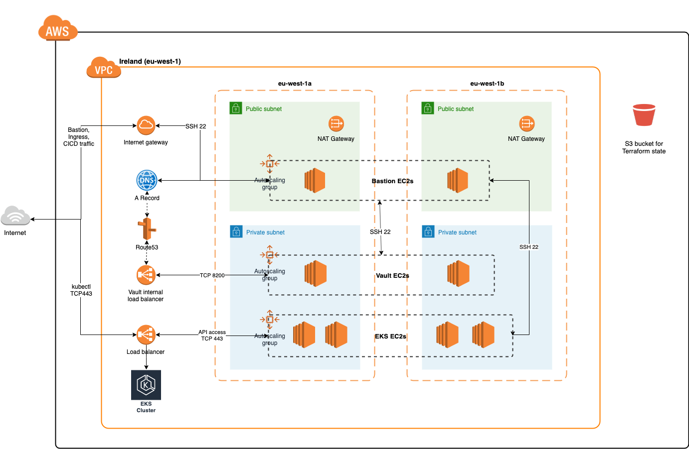

# Infrastructure Terraform Scripts for AWS

## Overview

The Terraform scripts in this folder create the following resources on AWS:

| File name            |                                     Description                                      |
| -------------------- | :----------------------------------------------------------------------------------: |
| `main.tf`            |                   For general stuff, like creating the VPC and AZs                   |
| `security_groups.tf` |                       Defines security groups for all service                        |
| `dns.tf`             |                                       are neat                                       |
| `provider.tf`        |                                  Defines providers                                   |
| `bastion.tf`         | Creates Bastion host, including Autoscaling groups, IP ranges, security groups, etc. |
| `vault.tf`           |           Creates Vault instances, including Autoscaling groups, EFS, etc            |
| `helm.tf`            |                                    Installs Helm                                     |
| `eks.tf`             |                                 Creates EKS cluster                                  |
| `k8s.tf`             |                         Creates Kubernetes resources on EKS                          |
| `rds.tf`             |                               Creates RDS resources                                  |

## Architecture diagrams

### AWS

Note: This architecture may not be updated. For latest version please go to https://alm.accenture.com/wiki/display/BLOCKOFZ/AWS

## Deploying the Infrastructure

The infrastructure was deployed using this Jenkins pipeline: https://blockchaincloud-app.jenkins.adop.accenture.com/job/Infrastructure/job/fulcrum-infrastructure/.

The pipeline automatically detects for new commits every minute and will trigger a new build if there's a new commit.

Please use the same Jenkins pipeline for all deployments.
